Certainly. Your vision for a modern, interactive glitch animation platform is ambitious and achievable with the right architecture. Based on your requirements and the available information, here is a comprehensive technical blueprint designed for performance, scalability, and a premium user experience, optimized for the Vercel ecosystem.

### **Modern Glitch Factory: Complete Technical Architecture**

This document outlines the architecture for a web-based platform where users can create, customize, preview in real-time, and save complex animated glitch effects.

---

### **1. Technology Stack & Deployment (The Vercel-Centric Foundation)**

This stack is chosen for its developer experience, performance, and seamless integration with Vercel's infrastructure.

*   **Frontend Framework**: **Next.js 15 (App Router)**. This is the optimal choice for Vercel, enabling:
    *   **Server-Side Rendering (SSR)**: Crucial for SEO, allowing search engines to crawl fully rendered pages.
    *   **Static Site Generation (SSG)**: For blazing-fast, cacheable pages like the homepage and documentation.
    *   **React Server Components & Streaming**: For efficient server rendering and progressive loading of the interactive editor.
*   **Backend & Database**: **Supabase**. It provides a secure, scalable PostgreSQL database, Row-Level Security (RLS), and built-in authentication—perfect for saving user configurations.
*   **Styling**: **Tailwind CSS**. Enables rapid UI development for "cool modern looking" interfaces with round corners and responsive design.
*   **Animation & Interaction**:
    *   **Framer Motion**: For smooth, declarative UI animations (panel transitions, button feedback).
    *   **GSAP (GreenSock Animation Platform)**: The industry standard for high-performance, complex JavaScript animations. Its `ScrollTrigger` plugin is ideal for implementing the scroll effects you desire.
    *   **WebGL Library (Three.js)**: For advanced glitch effects involving 3D shapes, particles, or sophisticated ASCII art rendering that exceeds CSS capabilities.
*   **Deployment**: **Vercel**. Offers global CDN, serverless function hosting, and automatic Git integrations, which are essential for performance and SEO.

### **2. Core System Architecture & Implementation**

The application is structured into three main parts: the glitch engine, the interactive editor, and the user backend.

```mermaid
flowchart TD
    User["👤 User"] --> UI["Web App UI<br>(Next.js 15 + React)"]

    subgraph "Editor & Preview Layer"
        UI --> ControlPanel["Control Panel<br>Sliders/Selectors"]
        UI --> PreviewCanvas["Live Preview Canvas"]
        ControlPanel -- "Configuration Changes" --> PreviewCanvas
    end

    subgraph "Glitch Engine Core"
        PreviewCanvas --> CSSFX["CSS Glitch Engine<br>(Text/Shapes)"]
        PreviewCanvas --> WebGLFX["WebGL/Canvas Engine<br>(Complex/3D)"]
    end

    subgraph "Data & Export Layer"
        UI --> SaveLoad["Save / Load<br>User Config"]
        PreviewCanvas --> Export["Export Module<br>GIF/MP4/WebM"]
    end

    SaveLoad --> Supabase["Supabase<br>(PostgreSQL + Auth)"]
```



#### **A. The Glitch Engine: How Effects Are Generated**
Effects will be generated through a layered approach:
*   **CSS-Based Effects**: For text glitches, color shifts, and simple distortions. This can be achieved using layered `box-shadow`/`text-shadow`, `clip-path`, and `@keyframes` animations, as demonstrated in multiple examples. CSS is fast and lightweight for many preset effects.
*   **WebGL/Canvas-Based Effects**: For the "glitching eye," "pulsating ASCII art," and complex shape-based distortions. A **modular shader system** will be core here. Users can combine pre-written GLSL shader modules (e.g., `noise.glsl`, `chromaticAberration.glsl`, `pixelate.glsl`) via the UI.

#### **B. The Interactive Editor & Real-Time Preview**
*   **UI Components**: A control panel with sliders (for animation length, intensity), dropdowns (for shapes: circles, strips, custom SVGs), color pickers, and toggle switches (loop, reverse).
*   **State Management**: React `useState`/`useReducer` or Zustand to manage the entire glitch configuration object.
*   **Live Preview**: The configuration state feeds directly into the rendering engine (CSS or WebGL). For performance, the preview canvas will use `requestAnimationFrame` and throttle heavy calculations. The **"Export"** function will use this same engine but render at the user-selected quality/resolution.

#### **C. User Data & Persistence**
*   **Data Model**: As you specified, **only the configuration is saved, not the output**. A "Creation" record in Supabase will store a JSON object containing all slider values, selected options, and shader module names.
    ```json
    {
      "effectName": "Cyberpunk Eye",
      "config": {
        "duration": 2.5,
        "loop": true,
        "reverse": false,
        "quality": "high",
        "shapes": ["circle"],
        "shaderModules": ["noise", "rgbSplit"],
        "params": { "noiseIntensity": 0.7, "splitDistance": 5 }
      }
    }
    ```
*   **Authentication**: Supabase Auth handles user sign-up/login.
*   **Security**: Supabase **Row Level Security (RLS)** ensures users can only access their own creations.

### **3. Search Engine Optimization (SEO) Strategy**
Visibility is key for a creative platform. Next.js provides a strong foundation.
*   **Meta Tags**: Use the `next/head` component to set unique titles, descriptions, and Open Graph tags for each glitch preset and user profile page.
*   **Semantic HTML & Structure**: Use proper heading hierarchies (`<h1>`, `<h2>`) and descriptive URLs (e.g., `/glitch-presets/cyberpunk-text-effect`).
*   **Performance as SEO**: Google favors fast sites. Vercel's global CDN and Next.js's image optimization will ensure high Core Web Vitals scores.
*   **Sitemap & Robots.txt**: Generate automatically via `next-sitemap` and submit to Google Search Console.

### **4. Monetization & "Advert Page" Implementation**
A supporter page is a great, non-intrusive monetization method.
*   **Implementation**: A dedicated page (`/supporters`) listing individuals or companies who support the project.
*   **Features**:
    *   **Tiered Recognition**: Different contribution levels (e.g., "Glitch Pioneer," "Pixel Patron") with distinct visual treatments.
    *   **Interactive Elements**: Supporters could have a custom, subtle glitch effect applied to their name on the list, created with the platform's own tools.
    *   **Call-to-Action**: A clear link to a payment processor (Stripe, PayPal) and a message explaining how support funds development and hosting.

### **5. Development Roadmap & Considerations**
*   **Phase 1 (MVP)**: Core Next.js app with Supabase auth. Implement 5-10 CSS-based glitch presets with a basic editor. Launch the supporter page.
*   **Phase 2 (Advanced Effects)**: Integrate Three.js/WebGL engine. Develop the shader module system and shape library.
*   **Phase 3 (Community & Export)**: Add user profiles, public galleries of creations, and robust video/GIF export functionality.
*   **Performance Monitoring**: Be mindful of Vercel serverless function cold starts and database region selection to minimize latency, as highlighted in community discussions. Use ISR or caching strategies for public galleries.

This architecture provides a scalable, secure, and performant path to build your "cool modern" glitch animation platform. The combination of Next.js, Supabase, and Vercel is a proven stack that aligns perfectly with your goals for interactivity, user accounts, and SEO.

Would you like me to elaborate on any specific section, such as the detailed schema for the Supabase database or a sample implementation for one of the glitch effects?